# Image-Quilting-and-Texture-Synthesis

## Contributors

[Samarjeet Sahoo](https://github.com/samar97)

[Aniket Shirke](https://github.com/ani8897)

[Huzefa Chasmai](https://github.com/huzzzz)

## Files

### Main files

1. [mainQuilting.m](mainQuilting.m): main file for Image Quilting 
2. [mainTransfer.m](mainTransfer.m): main file for Texture Transfer

### Helper files

1. [minErrorBoundaryCut.m](minErrorBoundaryCut.m): Function to return the final patched up section using the selected patch and neighbor patches (Image Quilting)
2. [findClosestPatch.m](findClosestPatch.m): Helper function to return a random patch amongst the closest patches to the given patch in the original image (Image Quilting)
3. [findClosestTransferPatch.m](findClosestTransferPatch.m): Helper function to return a random patch amongst the closest patches to the given patch in the original image (Texture Transfer)
4. [findCorrespondenceError.m](findCorrespondenceError.m): Helper function to return correspondence error between two patches, the measure is a simple difference between intensities or the luminance (Texture Transfer)
5. [findError.m](findError.m): Helper function to return the error in the overlap region (Image Quilting)
6. [getFirstTransferPatch.m](getFirstTransferPatch.m): Helper function to return the random first patch (Texture Transfer)
7. [getRandomPatch.m](getRandomPatch.m): Helper function to return a random patch of specified size from a given image
8. [rmsError.m](rmsError.m): Helper function to return the root mean squared error between two patches 
9. [saveFigure.m](saveFigure.m): Helper function to display and save 2 processed images
10. [saveFigure3.m](saveFigure3.m): Helper function to display and save 3 processed images

## Results

### Image Quilting

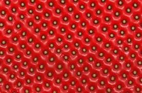 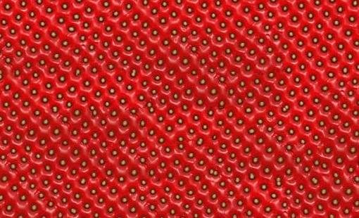

 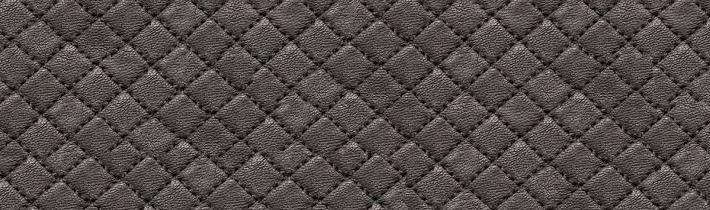

 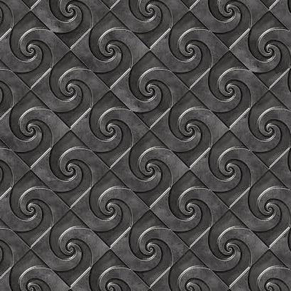

 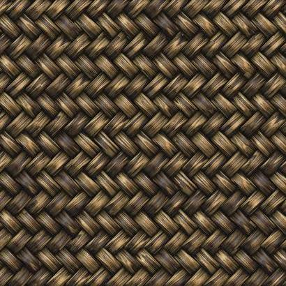

 

 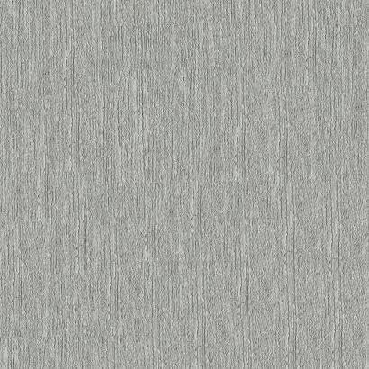

 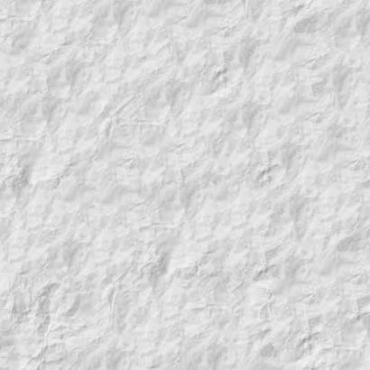

 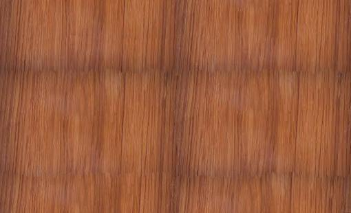

 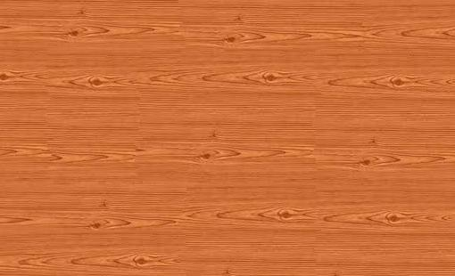

 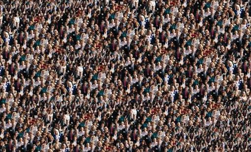

 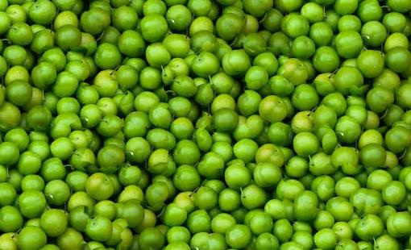

 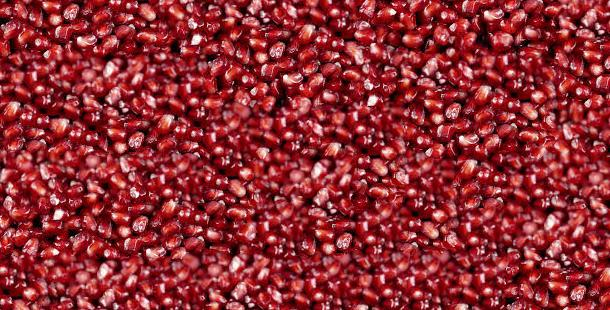

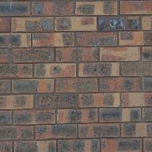 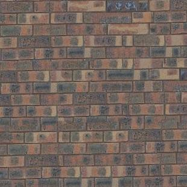

 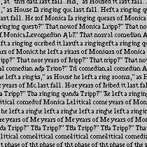

### Texture Transfer

   

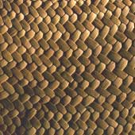   

